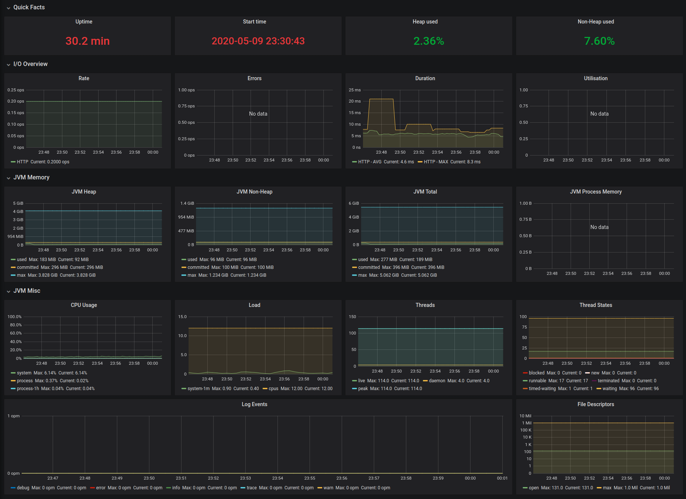

# prometheus-micrometer-example
An example of how to configure the Micrometer to expose metrics for Prometheus

# Motivation
The objective of this project is to demonstrate a basic configuration for the use of the micrometer. The configuration exposes JVM metrics on port 9090 in the format expected by Prometheus.

With [this another project](https://github.com/robsonbittencourt/monitoring-micrometer) you can run as Prometheus and visualize metrics from this project on Grafana.



# Running
You can import this project on your IDE and run `PrometheusMicrometerExampleApplication.java` main class, or use Docker.

```
docker run \
    -p 8080:8080 \
    -p 9090:9090 \
    --name prometheus-micrometer-example \
    robsonbittencourt/prometheus-micrometer-example
```